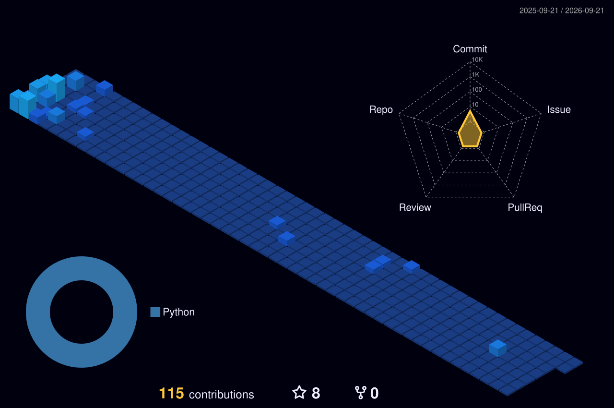

<div align="center">

<!-- ══ ENCABEZADO ANIMADO ══ -->
<a href="https://github.com/andresp08">
  
</a>

<!-- ══ CONTACTO ══ -->
<p>
  <a href="https://www.linkedin.com/in/andr%C3%A9s-felipe-pardo-campos-50386121a/"></a>
  <a href="mailto:andresfp292@gmail.com"></a>
  <a href="https://github.com/andresp08/PersonalPortfolio"></a>
</p>

<p>
  
  <a href="https://github.com/andresp08?tab=followers"></a>
  <a href="https://github.com/andresp08?tab=repositories&sort=stargazers"></a>
</p>

</div>

---

## 👨‍💻 About me

Backend-focused software engineer from Colombia. I build services with **Java and
Spring Boot**, work across the stack with **Angular** when a project needs it, and
care about the part most people skip: keeping a codebase understandable after the
first release.

```java
public record Andres(String role, String base, List<String> stack) {

    static Andres profile() {
        return new Andres(
            "Software Engineer",
            "San Gil, Colombia",
            List.of("Java", "Spring Boot", "Angular", "Microservices")
        );
    }

    String currentFocus() {
        return "Designing backend services that stay simple as they grow";
    }

    String exploring() {
        return "Spring AI — retrieval and LLM-backed endpoints on the JVM";
    }
}
```

- 🎯 **Day to day:** Java · Spring Boot · REST APIs · microservices · MySQL
- 🧱 **Care about:** clean architecture, testing, and code that survives handoff
- 🧠 **Currently exploring:** **Spring AI** — adding retrieval and LLM-backed
  endpoints to Java services
- 🎓 Systems Engineering graduate, largely self-taught in practice
- 🤝 Open to backend and open-source collaboration
- ⚽ Away from the keyboard: football
- 📫 **andresfp292@gmail.com**

<!-- ══ CLIMA EN VIVO — lo actualiza .github/workflows/weather.yml ══ -->
<div align="center">

### ⛅ Right now in San Gil

<!-- WEATHER:START -->
| 🌧️ Condition | 🌡️ Temp | 🤔 Feels like | 💧 Humidity | 💨 Wind | 🌅 Sunrise | 🌇 Sunset |
| :---: | :---: | :---: | :---: | :---: | :---: | :---: |
| Light Rain | 21°C | 22°C | 89% | 0.5 m/s | 05:45 | 17:59 |

<sub>📍 San Gil · last updated Tuesday, 01 Sep 2026 at 22:01 (auto-refreshed every 6h by GitHub Actions)</sub>
<!-- WEATHER:END -->

</div>

---

## 🚀 Languages and Tools

<div align="center">

**Working with**


**Learning**


**Daily drivers**


</div>

---

## 📊 My GitHub stats

<div align="center">

<!-- Generado por .github/workflows/metrics.yml y commiteado en este repo.
     Vive en GitHub, no en un servicio externo: siempre carga. -->


</div>

---

## 🧊 Contribution art

<div align="center">

<!-- Calendario 3D — lo regenera .github/workflows/profile-3d.yml cada día -->


<!-- Snake — lo regenera .github/workflows/snake.yml cada día -->
<picture>
  <source media="(prefers-color-scheme: dark)" srcset="https://raw.githubusercontent.com/andresp08/andresp08/output/github-snake-dark.svg" />
  <source media="(prefers-color-scheme: light)" srcset="https://raw.githubusercontent.com/andresp08/andresp08/output/github-snake.svg" />
  
</picture>

</div>

---

## 🗓️ Coding habits

<div align="center">

<!-- Generado por .github/workflows/metrics.yml -->


</div>

<!-- Los repos destacados usan la función nativa de pinned repositories de
     GitHub, que aparece arriba de este README en el perfil. No se cae nunca. -->

---

<!-- ══ ACTIVIDAD RECIENTE — la llena .github/workflows/activity.yml ══ -->
<details>
<summary><b>⚡ Recent GitHub activity</b></summary>

<!--START_SECTION:activity-->
<!--END_SECTION:activity-->

</details>

---

<div align="center">

_Thanks for stopping by — if something here is useful, a ⭐ goes a long way._


</div>
